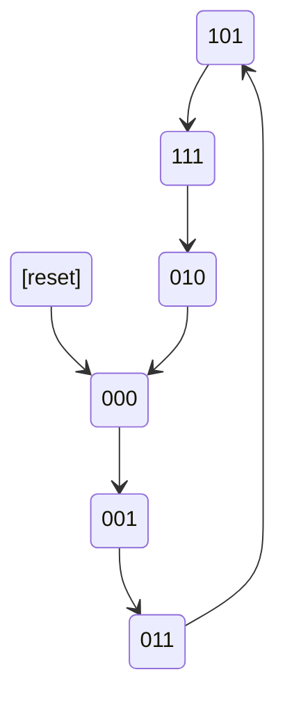

# 🧮 ROM-Based Finite State Machine (FSM) in VHDL
---
## 🏗️ Project Description
This VHDL implementation demonstrates a ROM-based finite state machine with:
- 🎛️ 3-bit state encoding
- 📚 ROM-stored state transitions and outputs
- ✅ Self-checking testbench verification
---
## 📂 File Structure
---
### 🧩 Core Components
| File | Description  Emoji |
|------|--------------------|
| `rom_fsm.vhd` | ROM storing next states and outputs  🧠 |
| `reg3.vhd` | 3-bit register for state storage  ⏱️ |
| `top.vhd` | Top-level entity connecting components  🏗️ |

### 🧪 Verification
| File | Description |
|------|--------------------|
| `tb.vhd` | Testbench with automatic pattern verification  ✅ |

## 📖 ROM Configuration
The ROM contains 8 entries with the following mapping:

| Address (Current State) | Next State | Output  |
|-------------------------|------------|---------------|
| `000` | `001` | `000`  |
| `001` | `011` | `001`  |
| `010` | `000` | `010`  |
| `011` | `101` | `011`  |
| `100` | `000` | `000`  |
| `101` | `111` | `101`  |
| `110` | `000` | `000`  |
| `111` | `010` | `111`  |

## 🔄 State Transition Diagram

---
## ✨ Key Features

- **📦 Compact implementation** - Uses efficient ROM storage
- **⏱️ Synchronous operation** - Clocked registers ensure stability
- **🧱 Modular design** - Easy to modify components

## 📜 License 

**MIT License** - Feel free to use and modify! 🎨
