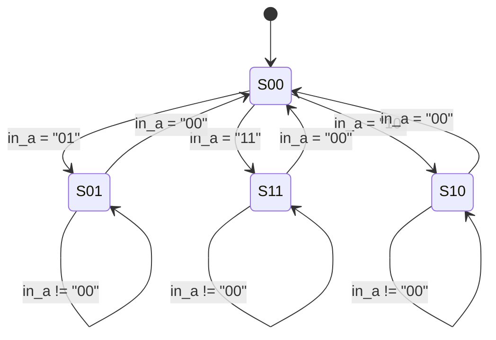

# 🌀 Finite State Machine (FSM) in VHDL

This repository contains a VHDL implementation of a finite state machine (FSM) with four states. The design includes the state transition logic, output logic, and a testbench for verification. 🚀

## 📂 Files Overview

### 1. `fsm_package.vhd`
📦 Defines the state type for the FSM with four states: `S00`, `S01`, `S10`, `S11`.

---

### 2. `next_state_logic.vhd`
🔄 Implements the state transition logic based on:
- Current state (`in_currentState`)
- 2-bit input vector (`in_a`)

**Key behavior:**
- From `S00`: Transitions to `S01`, `S11`, or `S10` based on input
- From other states: Returns to `S00` when input is "00", otherwise maintains state

---

### 3. `output_logic.vhd`
💡 Generates the output (`out_y`) based on:
- Current state (`in_currentState`)
- Previous output (`in_prevOutput`)

**Output rules:**
- `S00`: Maintains previous output
- `S01`: Outputs '0'
- `S11`: Outputs '1'
- `S10`: Toggles previous output (✨ magic toggle!)

---

### 4. `state_register.vhd`
⏱️ Implements the state register with:
- Clock (`in_clk`)
- Reset (`in_reset`)
- State update on rising clock edge
- Reset sets state to `S00` (back to square one!)

---

### 5. `top_fsm.vhd`
🏗️ Top-level module connecting:
- State register
- Next state logic
- Output logic
- Output register

---

### 6. `tb_fsm.vhd`
🧪 Testbench that verifies FSM functionality with test sequences:

1. **Sequence (i):** "01" → "00" → Output = 0  
2. **Sequence (ii):** "11" → "00" → Output = 1  
3. **Sequence (iii):** "10" → "00" → Output toggle  
   - Followed by repeated toggle test (flip-flop fun! 🤹)
---
## 🤖 FSM Behavior

### State Transitions

---
## 💡 Output Logic

| State | Output Rule           |
|-------|-----------------------------|
| S00   | Maintain previous     🔄    |
| S01   | Output '0'            0️⃣    |
| S11   | Output '1'            1️⃣    |
| S10   | Toggle previous       🔄➡️🔀 |
---
## 📈 Expected Waveforms

After reset release:
- **Sequence (i):** Output becomes 0  
- **Sequence (ii):** Output becomes 1  
- **Sequence (iii):** Output toggles (0 → 1 → 0... like a light switch! 💡)
---
## 🌟 Key Features

- **Modular design** with clear separation of concerns 🧩  
- **Synchronous state transitions** ⏱️  
- **Registered output** to prevent glitches 🛡️  
- **Comprehensive testbench** with key test sequences 🧪  
- **Reset initialization** to known state (S00) 🔄  
---
## 📜 License

This project is licensed under the MIT License - see the [LICENSE](LICENSE) file for details.
